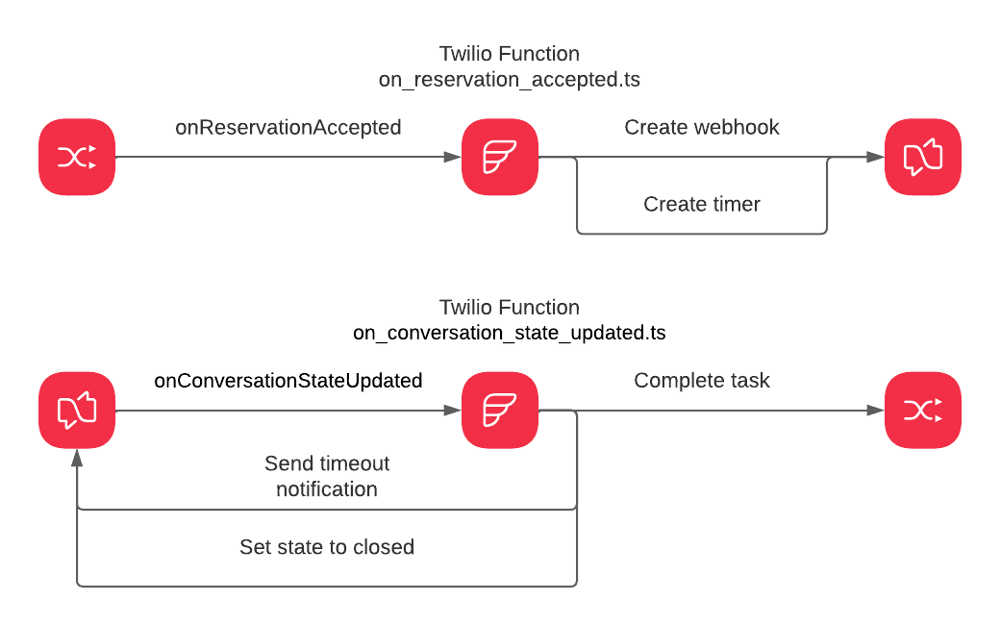

# flex-chat-inactivity-timeout

## Project summary

This project shows how you can leverage Twilio Functions and State Timers feature of Conversations API to crete automated handling of inactive tasks.

As you may already know Twilio has released [Flex Conversation to Private Beta](https://www.twilio.com/changelog/announcing-flex-conversations-public-beta). 
This is a big step forward in making orchestration more reliable and straightforward within Flex ecosystem. 
In [a blogpost here](https://www.twilio.com/blog/flex-conversations-public-beta) you can learn more about all the new perks of Flex Conversations. 
Introducing Flex Conversations also opens up possibilities for a new cool features to be implemented, as the ConversationsAPI provides broad spectrum of tools for managing participants, addresses and conversation lifecycle.
One of the contact centre features that our customers are asking for is Inactivity Timeout. 
Indeed, in order to keep your agents productivity on the highest level it necessary to have an automated way of keeping track of abandoned tasks and clean them up. 
With the [State Timers](https://www.twilio.com/docs/conversations/states-timers) feature of Conversations API and Twilio Functions it is possible now to implement Inactivity Timeout in Flex.

For more details on the project head to the blogpost [here.](https://www.twilio.com/blog/tag/functions)

## Diagram



## Developer environment setup
Make sure you have the software you need:

- [node.js](https://nodejs.org/) and [npm](https://docs.npmjs.com/downloading-and-installing-node-js-and-npm)
- [Twilio CLI](https://www.twilio.com/docs/twilio-cli/quickstart)
- [Twilio Serverless Toolkit](https://www.twilio.com/docs/labs/serverless-toolkit)

## Environment variables

```shell
ACCOUNT_SID=<Twilio Account SID>
AUTH_TOKEN=<Twilio Auth Token>
TIMEOUT=PT1M
TASK_ROUTER_WORKSPACE=<TaskRouter Workspace SID>
```

Note: PT1M - is one minute of duration according to [ISO 8601](https://en.wikipedia.org/wiki/ISO_8601)

## Available scripts
`npm run start` - starts project locally
`npm run deploy` - deploys project to Twilio Functions using credentials from .env file

## Tutorial
The blogpost with tutorial for this project you will find [here.](https://www.twilio.com/blog/tag/functions)

## Disclaimer
The project published as-is as sample code.